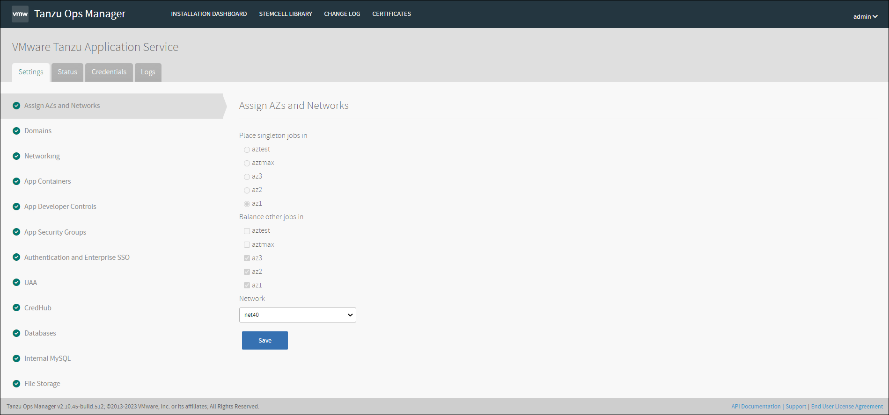
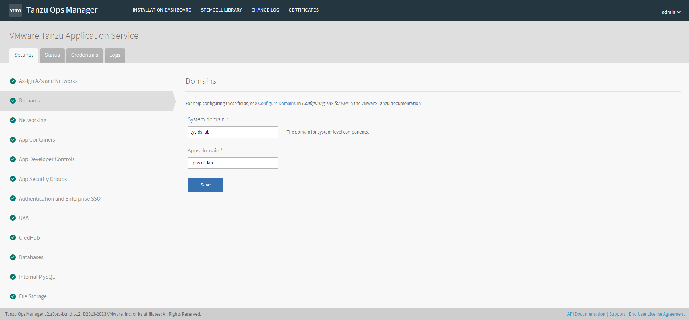
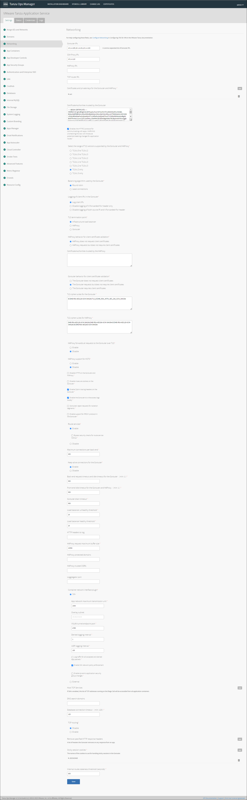

# 설치 방법

## TAS 설치

#### VMware Tanzu Application Service

#### VM용 TAS 리소스 요구사항

- 일반적인 요구사항

#### VM용 TAS 구성

**전제 조건**

이 절차를 시작하기 전에 다음을 수행해야 합니다.

- Ops Manager에 맞게 환경을 준비하고 BOSH Director를 설치 및 구성하는 단계를 성공적으로 완료했는지 확인하십시오.

**Ops Manager에 VM용 TAS 추가**

VM용 TAS를 구성하려면 먼저 Ops Manager 설치 대시보드에 VM용 TAS 타일을 추가해야합니다.

IMPORT A PRODUCT 버튼을 클릭하여 Ops Manager에 추가합니다.

- **Assign AZs and Networks**

1.  ****Place singleton jobs****: 첫 번째 AZ를 선택합니다. Ops Manager는 이 AZ에서 단일 인스턴스로 모든 작업을 실행합니다.

2. **Balance other jobs**: Ops Manager는 지정한 AZ에서 작업 인스턴스 둘 이상의 인스턴스와 균형을 맞춥니다.(고가용성을 위하여 최소 3개의 AZ를 권장합니다.)

3. **Network**: BOSH Director 타일을 구성할 때 생성한 런타임 네트워크를 선택합니다.

##### 모든 설정 입력 후 Save를 클릭합니다.

- **Domains**

1.  **System domain**: System 도메인으로 사용할 주소를 입력합니다. ex. sys.ds.lab

2. **Apps domain**: Apps 도메인으로 사용할 주소를 입력합니다. ex. apps.ds.lab

##### 모든 설정 입력 후 Save를 클릭합니다.

- **Networking**

