# 설치 방법

## TAS (VMware Tanzu Application Service) 설치

### VM용 TAS 구성

***전제 조건***

이 절차를 시작하기 전에 다음을 수행해야 합니다.

- Ops Manager에 맞게 환경을 준비하고 BOSH Director를 설치 및 구성하는 단계를 성공적으로 완료했는지 확인하십시오.

**Ops Manager에 VM용 TAS 추가**

VM용 TAS를 구성하려면 먼저 Ops Manager 설치 대시보드에 VM용 TAS 타일을 추가해야합니다.

IMPORT A PRODUCT 버튼을 클릭하여 Ops Manager에 추가합니다.

- ### **Assign AZs and Networks**

1.  ****Place singleton jobs****: 첫 번째 AZ를 선택합니다. Ops Manager는 이 AZ에서 단일 인스턴스로 모든 작업을 실행합니다.

2. **Balance other jobs**: Ops Manager는 지정한 AZ에서 작업 인스턴스 둘 이상의 인스턴스와 균형을 맞춥니다.(고가용성을 위하여 최소 3개의 AZ를 권장합니다.)

3. **Network**: BOSH Director 타일을 구성할 때 생성한 런타임 네트워크를 선택합니다.

##### 모든 설정 입력 후 Save를 클릭합니다.

- ### **Domains**

1.  **System domain**: System 도메인으로 사용할 주소를 입력합니다. ex. sys.ds.lab

2. **Apps domain**: Apps 도메인으로 사용할 주소를 입력합니다. ex. apps.ds.lab

##### 모든 설정 입력 후 Save를 클릭합니다.

- ### **Networking**

1. **Gorouter IPs 및 HAProxy IPs** : HAProxy를 사용하는 여부에 따라 설정을 진행합니다. 

※ *Note:  Gorouter IP 또는 HAProxy IP 필드에서 특정 IP 주소를 할당하도록 선택한 경우 이러한 IP 주소가 Ops Manager에서 VM용 TAS에 대해 구성한 서브넷에  있는지 확인하십시오.*

| HAProxy 사용여부 | Gorouter IP 필드 | HAProxy IP 필드 |
| ------------ | -------------- | ------------- |
|              |                |               |

2. (선택) **SSH Proxy IPs 및 TCP router IPs** : SSH Proxy 포트 2222의 앱 컨테이너에 대한 SSH 요청을 수락하는 Diego Brain IP 주소를 추가합니다. TCP router에 할당하려는 IP 주소를 추가합니다. 이 창 하단에서 이 기능을 활성화 합니다. 

3. **Certificates and private keys for the Gorouter and HAProxy** : 하나 이상의 인증서와 개인 키 및 인증서 키 쌍을 Gorouter 및 HAProxy에 제공해야합니다. Gorouter 및 HAProxy 는 기본적으로 TLS 통신을 수신하도록 활성화 되어 있습니다. 
   
   - Name : 생성하고자 하는 이름
   
   - Certificate and private key 아래 Generate RSA Certificate 클릭 
     
     - ex) `*.DOMAIN.com`, `*.apps.DOMAIN.com`, `*.sys.DOMAIN.com`,`*.login.sys.DOMAIN.com`, `*.uaa.sys.DOMAIN.com` 
   
   - 추가 필요 시 Add 버튼을 클릭

4. (선택)**Certificate Authorities trusted by the Gorouter** : 상호 TLS를 사용하여 클라이언트 요청을 검증할 때 Gorouter는 기본적으로 CA를 신뢰합니다. Gorouter와 동일한 CA를 신뢰하도록 HAProxy를 구성하려면 해당 칸에 CA인증서를 입력합니다. 

5. (선택)**Enables the HTTP/2 protocol for communicating with apps** : Gorouter에 대한 HTTP/2 수신 및 송신을 비활성화하려면 해당 칸을 선택 취소합니다. HTTP/2는 기본적으로 활성화 되어있습니다. 

6. **Select the range of TLS versions supported by the Gorouter and HAProxy** : Gorouter 및 HAProxy 통신에서 사용할 TLS 버전 범위를 선택합니다. 

7. (선택)**Balancing algorithm used by the Gorouter** : Gorouter에 대한 로드 밸런싱 알고리즘을 선택합니다. 기본 옵션인 라운드로빈을 권장합니다. 

8. **Logging of client IPs in the Gorouter** : Log client IPs 옵션은 기본적으로 설정됩니다. 로드 밸런서가 자체 소스 IP 주소를 노출하는 경우 Disable logging of X-Forwarded-For header only를 로드 밸런서가 원래 클라이언트 소스 IP를 노출하는 경우 Disable logging of both source IP and X-Forwarded-For header를 선택합니다.

9. **TLS termination point** : x-forwarded-client-cert 배포에서 TLS가 처음 종료되는 위치를 기반으로 VM용 TAS HTTP 헤더를 처리하는 방법으로 구성합니다.
   
   | Deployment Configuration                                                                                   | TLS Option                   | Additional Notes                                                                |
   | ---------------------------------------------------------------------------------------------------------- | ---------------------------- | ------------------------------------------------------------------------------- |
   | - 로드 밸런서가 TLS를 종료 - 로드 밸런서는 상호 인증 TLS handshake의 클라이언트 인증서를 x-forwarded-client-cert HTTP 헤더에 넣도록 구성됩니다. | Infrastructure load balancer | HAProxy와 Gorouter 모두 요청에 포함될 때 XFCC 헤더를 전달합니다.                                  |
   | - 로드 밸런서는 TCP를 통해 HAProxy의 인스턴스로 TLS handshake를 통과하도록 구성되어 있습니다.  - HA Proxy 인스턴스 수가 0 보다 많습니다.         | HA Proxy                     | HA Proxy는 TLS handshake에서 받은 클라이언트 인증서로 XFCC 헤더를 설정합니다. Gorouter는 헤더를 전달합니다.    |
   | - 로드 밸런서는 TCP를 통해 TLS 핸드셰이크를 통해 Gorouter의 인스턴스로 전달하도록 구성됩니다.                                               | Gorouter                     | Gorouter는 요청에 포함된 XFCC 헤더를 제거하고 TLS handshake에서 받은 클라이언트 인증서를 새 XFCC 헤더로 전달합니다. |

10. **HAProxy behavior for client certificate validation** : 
    
    -  HAProxy does not request client certificates : TLS termination point는 HA Proxy와 호환되지 않습니다. HAProxy는 클라이언트 인증서를 요청하지 않으므로 클라이언트가 인증서를 제공하지 않으며 유효성 검사가 발생하지 않습니다.
    
    -  HAProxy requests but does not require client certificates : HAProxy는 TLS handshake에서 클라이언트 인증서를 요청하고 제시될 때 유효성을 검사하지만 요구하지 않습니다. 

11. (선택)**Certificate Authorities trusted by the HAProxy** : 
    
    - 추가필요

12. **Gorouter behavior for client certificate validation** :
    
    - The Gorouter does not request client certificates : 클라이언트 인증서가 요청되지 않으므로 클라이언트가 이를 제공하지 않으며 클라이언트 인증서의 유효성 검사가 발생하지 않습니다.
    
    -  The Gorouter requests but does not require client certificates : Gorouter는 TLS handshake에서 클라이언트 인증서를 요청하고 제시될 때 유효성을 검사하지만 요구하지는 않습니다.
    
    - The Gorouter requires client certificates : Gorouter는 클라이언트 인증서가 Gorouter가 신뢰하는 인증 기관에 의해 서명되었는지 확인합니다.

13. **TLS cipher suites for the Gorouter** : Gorouter와 frontend 클라이언트(ex. 로드밸런서 또는 HAProxy)간의 TLS handshake에 대한 TLS 암호화 제품군을 검토합니다. 

14. **TLS cipher suites for HAProxy** : HAProxy와 frontend 클라이언트(ex. 로드밸런서 및 Gorouter)간의 TLS handshake에 대한 TLS 암호화 제품군을 검토합니다.

15. **HAProxy forwards all requests to the Gorouter over TLS** : HAProxy가 TLS를 통해 모든 요청을 Gorouter로 전달여부를 선택합니다.
    
    - Enable : Certificate authority for HAProxy back end 필드에 Gorouter 및 HAProxy에 대한 인증서 및 개인 키 필드에서 구성한 인증서에 서명한 CA를 제공합니다. 
    
    - Disable : Resource Config 창에서 HAProxy job 인스턴스 수를 0으로 설정합니다.

16. **HAProxy support for HSTS** : HAProxy에 요청할 때 브라우저에서 강제로 HTTPS를 사용 여부를 선택합니다.
    
    - Enable : HSTS요청에 대한 최대 기간(초)를 설정합니다. 하위 도메인 포함 확인란을 활성화 하여 브라우저가 모든 구성 요소 하위 도메인에 대해 HTTPS 요청을 사용하도록합니다. 확인란을 선택하여 HAProxy에 액세스하는 Google Chrome, Firefox 및 Safari의 인스턴스가 HTTPS가 필요한 알려진 호스트의 내장 목록을 참조하도록 강제합니다.
    
    - Disable : SSL 암호화를 사용하지 않거나 자체 서명된 인증서를 사용하는 경우 해당 칸을 선택합니다.

17. (선택)**Disable HTTP on the Gorouter and HAProxy** : Gorouter 또는 HAProxy가 HTTP 트래픽을 거부하도록 하려면 해당 칸을 선택합니다.

18. (선택)**Disable insecure cookies on the Gorouter** : Gorouter에서 생성된 쿠키에 대한 보안 플래그를 켜려면 해당 칸을 선택합니다.

19. (선택)**Enable Zipkin tracing headers on the Gorouter** : Zipkin 추적 헤더는 기본적으로 활성화되어 있습니다. 비활성화 하기 위해서는 해당 칸을 선택합니다.

20. (선택)**Enable the Gorouter to write access logs locally** : 기본적으로 선택되어 있습니다. VMware는 로그가 충분히 빠르게 회전되지 않고 디스크를 가득 채울 수 있도록 트래픽이 많은 배포의 경우 이 확인란을 선택 취소할 것을 권장합니다.

21. (선택)**Gorouters reject requests for isolation segments** : 기본적으로 TAS Gorouter는 Isolation segment 타일에서 생성된 Isolation segment에 배포된 앱의 트래픽을 처리합니다. 각 Isolation segment에 대해 Gorouter를 배포하지 않으려면 이 옵션을 활성화하지 않습니다. 

22. (선택)**Enable support for PROXY protocol in the Gorouter** : 기본적으로 PROXY 프로토콜에 대한 Gorouter 지원은 비활성화되어 있습니다. PROXY 프로토콜을 활성화하려면 해당 칸을 선택합니다.

23. **Route services** : Route 서비스는 앱 요청 및 응답에 대해 필터링 또는 콘텐츠 변환을 수행하는 서비스 입니다. 

24. (선택)**Maximum connections per back end** : 백엔드에 대한 앱 연결 수를 제한하려면 백엔드당 최대 연결 값을 입력합니다. 기본값은 500입니다.

25. **Keep-alive connections for the Gorouter** : 활성화 비활성화를 선택할 수 있습니다. Keep-alive 연결은 기본적으로 활성화 되어있습니다.

26. (선택)**Back end request timeout and idle timeout for the Gorouter** : 대기 시간이 긴 연결을 통해 더 큰 업로드를 수용하려면 백엔드에 대한 Gorouter 제한 시간 필드에서 초 수를 늘립니다.

27. (선택)**Front end idle timeout for the Gorouter and HAProxy** : 프런트엔드 유휴제한 시간을 사용하여 로드 밸런서에서 Gorouter 또는 HAProxy로의 연결이 조기에 닫히지 않도록 합니다.

28. (선택)**Gorouter drain timeout** : Gorouter가 종료되기 전에 기존 연결을 계속 지속하도록 합니다. 기본값은 900입니다.

29. (선택)**Load balancer unhealthy threshold** : 해당 값을 늘려 Gorouter가 종료되기 전에 연결을 계속 수락하는 시간을 초 단위로 지정합니다. 이 기간 동안 상태 확인은 Gorouter를 비정상으로 보고할 수 있습니다.

30. (선택)**Load balancer healthy threshold** : 이 필드는 Gorouter 인스턴스가 시작되었다고 선언할 때 까지 대기하는 시간을 초 단위로 지정합니다. 

31. (선택)**HTTP headers to log** : 개발자가 HTTP 요청의 특정 HTTP 헤더를 Gorouter의 정보와 함께 앱 로그에 표시하려는 경우 기록합니다.

32. **HAProxy request maximum buffer size** : 기본 최대값인 16.384KB보다 큰 요청이 예상되는 경우 HAProxy 요청 최대 버퍼 크기에 새 값(바이트)을 입력하십시오.

33. TAS에 HAProxy를 사용하고 특정 소스에만 트래픽을 수신하도록 하려면 다음 필드를 구성합니다.
    
    - **HAProxy protected domains** : 알 수 없는 소스 요청으로부터 보호하기 위해 쉼표로 구분된 도메인 목록을 입력합니다. 
    
    - **HAProxy trusted CIDRs** : 공백으로 구분된 CIDR 목록을 입력하여 보호된 도메인의 IP 주소가 TAS로 트래픽을 보낼 수 있도록 제한합니다.

34. **Loggregator port** : 공백으로 비어있다면 443으로 설정됩니다. 

35. **Container network interface plugin** : 다음 옵션 중 하나를 선택합니다.
    
    - Silk : 이 옵션은 TAS의 기본 컨테이너 네트워크 인터페이스(CNI)입니다.
      
      - App network maximum transmission unit : MTU 값을 바이트 단위로 입력합니다. 기본값은 1454 입니다.
      
      - (선택)Overlay subnet : 오버레이 네트워크 IP 범위를 입력합니다. 범위를 설정하지 않으면 10.255.0.0/16 입니다.
      
      - VXLAN tunnel endpoint port : UDP 포트 번호를 입력합니다. VXLAN패킷을 수신하는 호스트 포트입니다. 사용자 지정 설정하지 않으면 4789를 사용합니다.
      
      - Denied logging interval : 컨테이너별 네트워킹 정책 또는 ORG, SPACE 또는 배포에 적용되는 ASG(App Security Group) 규칙에 의해 차단된 패킷에 대한 초당 속도 제한을 설정합니다. 이 필드의 기본값은 1입니다.
      
      - UDP logging interval : 전송 및 수신되는 UDP 패킷에 대한 초당 속도 제한을 설정합니다. 이 필드의 기본값은 100 입니다. 
      
      - Log traffic for all accepted and denied app packets : 앱 트래픽에 대한 로깅을 활성화하려면 확인란을 활성화 합니다. 선택 시 로그양이 증가합니다.
      
      - Enable Silk network policy enforcement : 앱 간의 Silk 네트워크 정책 적용을 비활성화 하려면 확인란을 해제합니다. 기본적으로 선택되어 있습니다. 이 기능을 비활성화하면 모든 앱 컨테이너가 제한 없이 다른 모든 앱 컨테이너를 액세스할 수 있습니다.
      
      - Enable dynamic application security group changes : 컨테이너 재시작 없이 ASG를 앱에 적용할 수 있습니다. 
    
    - External : VMware NSX-T Container Plug-in을 배포하는 경우에 선택합니다.

36. **DNS search domains** : DNS 검색 도메인으로 사용할 앱 컨테이너의 도메인을 입력합니다.

37. **Database connection timeout** : 정책 서버 및 Silk 데이터베이스의 클라이언트에 대한 연결 제한 시간을 초 단위로 설정합니다. 기본값은 120입니다. 배포에서 컨테이너 간 네트워킹과 관련된 시간 초과 문제가 발생하는 경우 이 값을 늘려야 할 수 있습니다.

38. **TCP routing** : TCP 라우팅은 기본적으로 비활성화되어 있습니다. DNS가 TCP 라우터에 직접 전달되지 않고 로드 밸런서를 통해 TCP 트래픽을 보내는 경우 이 기능을 활성화해야 합니다.

39. (선택)**Remove specified HTTP response headers** : Gorouter가 앱 응답에서 제거할 헤더를 입력합니다.

40. (선택)**Sticky session cookies** : 하나 이상의 고정 세션 쿠키 이름을 입력합니다. 기본 쿠키 이름은 JSESSIONID 입니다. 일부 앱에는 다른 쿠키 이름이 필요합니다. 예를 들어 Spring WebFlux에는 SESSION 이름이 필요합니다. Gorouter는 이러한 쿠키를 사용하여 세션 선호도 또는 고정 세션을 지원합니다.

##### 모든 설정 입력 후 Save를 클릭합니다.

- ### **App Containers**

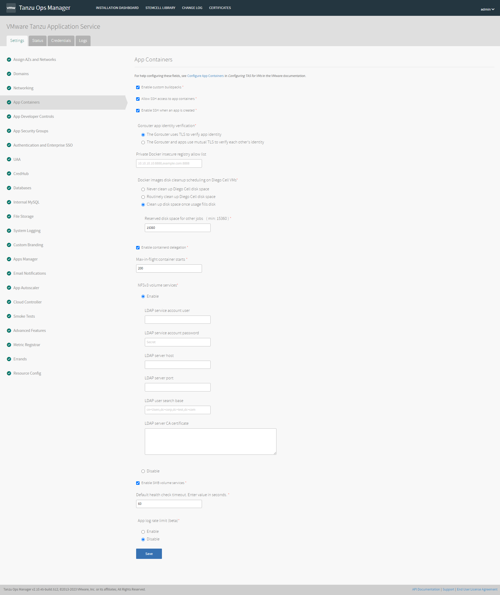

1. **Enable custom buildpacks** : cf push -b 명령 옵션 사용자 지정 빌드팩 URL을 전달하는 기능을 제어합니다. 이 기능은 기본적으로 활성화 되어 있어 개발자가 앱을 배포할 때 사용자 정의 빌드팩을 사용할 수 있습니다.

2. **Allow SSH access to app containers** : 앱 인스턴스에 대한 SSH 액세스를 제어합니다.

3. **Enable SSH when an app is created** : 기본적으로 새 앱에 대한 SSH 액세스를 활성화하려면 앱 생성 시 SSH 활성화 확인란을 선택합니다.

4. **Gorouter app identity verification** : Gorouter가 암호화를 활성화하고 잘못된 라우팅을 방지하기 위해 앱 ID를 확인하는 방법을 선택합니다.
   
   - The Gorouter uses TLS to verify app identity : Gorouter가 TLS를 사용하여 앱 ID를 확인할 수 있도록 합니다. 이것이 기본 옵션입니다.
   
   - The Gorouter and apps use mutual TLS to verify each other's identity : 이 옵션은 앱 컨테이너가 Gorouter에서 들어오는 통신만 수락하기 때문에 TCP 라우팅을 비활성화합니다.

5. **Private Docker insecure registry allow list** : 쉼표로 구분된 IP 주소 범위 목록을 제공하여 Docker 컨테이너에서 앱 인스턴스를 실행하도록 VM용 TAS를 구성할 수 있습니다.

6. **Docker images disk cleanup scheduling on Diego Cell VMs** : 디스크 사용량을 채워 디스크 공간 정리를 선택한 경우 Reserved disk space for other jobs에 MB 단위로 값을 입력합니다.

7. **Enable containerd delegation** : Garden이 컨테이너 생성 및 삭제 작업을 containerd 도구에 위임하는지 여부를 결정합니다. 기본적으로 이 옵션은 활성화되어 있으며 Garden은 containerd를 사용합니다.

8. **Max-in-flight container starts** : 이 숫자는 배포 시 디에고 셀에서 시작되는 최대 인스턴스 수를 구성합니다. 0은 제한이 없음을 의미합니다.

9. **NFSv3 volume services** : NFS 볼륨 서비스를 통해 앱 개발자는 공유 파일 액세스를 위해 기존 NFS 볼륨을 앱에 바인딩할 수 있습니다. (선택)NFSv3 볼륨 서비스에 대해 LDAP를 구성하려면 다음과 같이 설정합니다.
   
   - LDAP service account user : 볼륨 서비스를 관리할 LDAP 서비스 계정의 사용자 이름을 입력합니다.
   
   - LDAP service account password : 서비스 계정의 비밀번호를 입력합니다.
   
   - LDAP server host : LDAP 서버의 호스트 이름 또는 IP 주소를 입력합니다.
   
   - LDAP server port :  LDAP 서버 포트 번호를 입력합니다. 기본값은 389입니다.
   
   - LDAP user search base : LDAP 사용자 검색이 시작되는 LDAP 디렉토리 트리의 위치를 ​​입력합니다. 일반적인 LDAP 검색 기반은 도메인 이름과 일치합니다.
   
   - LDAP server CA certificate :  LDAP 서버가 TLS를 지원하고 NFS 드라이버에서 LDAP 서버로의 TLS 연결을 활성화하려는 경우 선택적으로 인증서를 입력할 수 있습니다.

10. **Enable SMB volume services** : SMB 볼륨 서비스를 활성화하면 개발자가 기존 SMB 공유를 앱에 바인딩할 수 있습니다. SMB 볼륨을 활성화하는 경우 Errands창에서 SMB Broker Errand를 On으로 설정합니다.

11. **Default health check timeout. Enter value in seconds** : 이 필드에 구성된 값은 앱 시작과 앱의 첫 번째 정상 응답 사이에 허용되는 시간입니다. 상태 확인이 구성된 제한 시간 내에 정상 응답을 받지 못하면 앱이 비정상으로 선언됩니다. 기본 제한 시간은 `60`초이고 구성 가능한 최대 제한 시간은 `600`초입니다.

12. (선택)**App log rate limit (beta)** : 앱 인스턴스가 초당 생성할 수 있는 로그 라인 수를 제한하려면 정수 값을 입력합니다.

##### 모든 설정 입력 후 Save를 클릭합니다.

- ### **App Developer Controls**

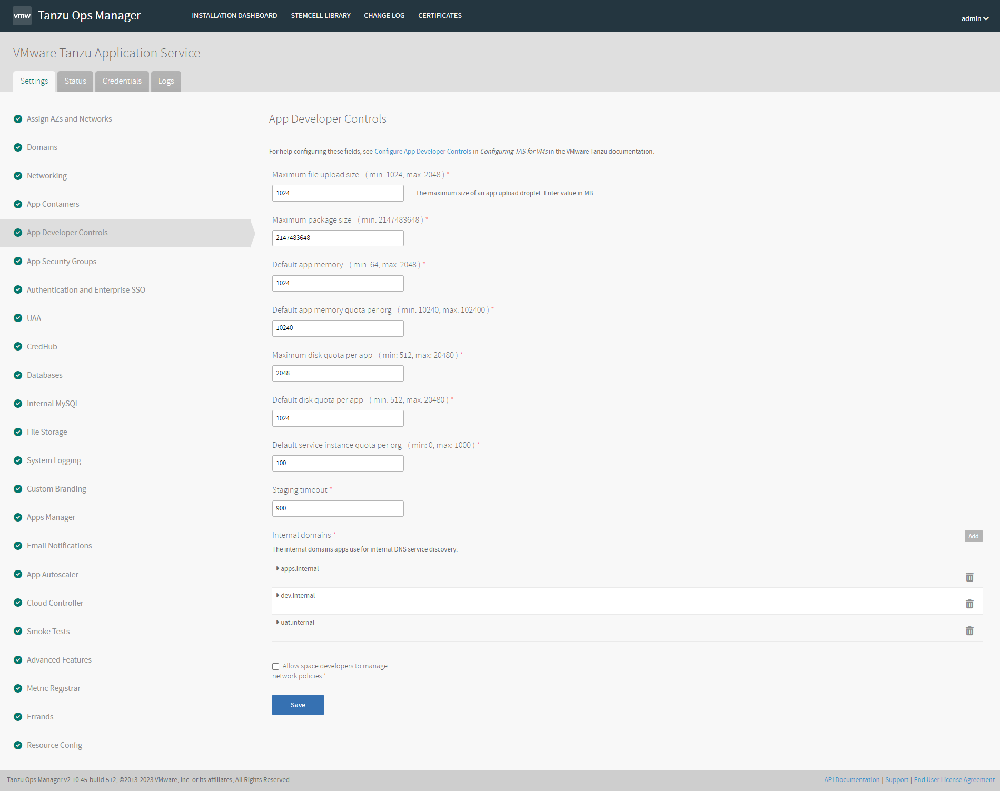

1. **Maximum file upload size** : 빌드팩을 포함한 앱 업로드의 최대 크기를 MB 단위로 입력합니다.

2. **Maximum package size** : 앱 파일의 최대 총 크기(MB)입니다.

3. **Default app memory** : 지정된 값이 없는 경우 새로 배포된 앱에 할당된 기본 메모리 양(MB)입니다.

4. **Default app memory quota per org** : ORG의 모든 앱에 대한 기본 메모리 제한입니다. 초기 설치 후 운영자가 cf CLI를 사용하여 기본값을 변경할 수 있습니다.

5. **Maximum disk quota per app** : 앱당 허용되는 최대 디스크 양입니다. 디스크 용량이 부족하면 큰 앱이 성공적으로 배포되지 않을 수 있습니다.

6. **Default disk quota per app** : 새로 배포된 앱에 기본적으로 할당된 디스크의 양입니다.

7. **Default service instance quota per org** : ORG 당 기본 서비스 인스턴스 할당량을 입력합니다. 초기 설치 후 운영자가 cf CLI를 사용하여 기본값을 변경할 수 있습니다.

8. **Staging timeout** : 클라우드 컨트롤러로 앱 droplet을 준비하면 이 필드에 지정한 시간(초) 후에 서버가 시간 초과됩니다.

9. **Internal domains** : 앱이 내부 DNS 서비스 검색에 사용하는 도메인을 하나 이상 입력합니다. 이 값의 기본값은 `apps.internal`입니다.

10. **Allow space developers to manage network policies** : 확인란을 활성화하여 개발자가 자신의 앱에 대한 자체 네트워크 정책을 관리하도록 허용할 수 있습니다.

##### 모든 설정 입력 후 Save를 클릭합니다.

- ### **App Security Groups**

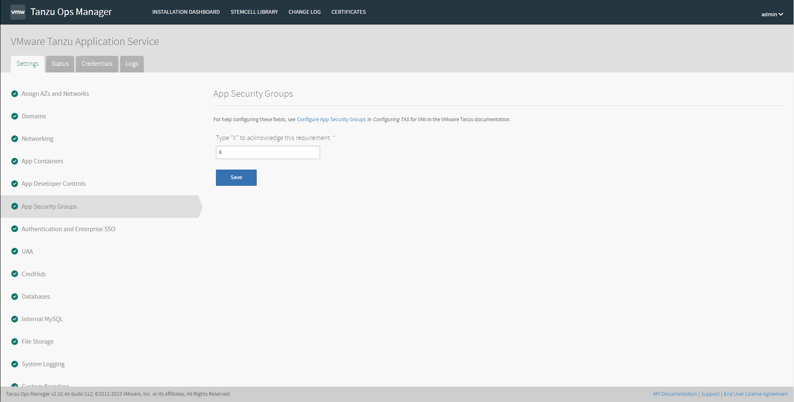

1. **Type "X" to acknowledge this requirement** : 안전한 앱 배포를 위해서는 적절한 앱 보안 그룹을 설정하는것이 중요합니다. TAS for VMs 배포가 완료된 후 적절한 앱 보안 그룹 설정에 대한 책임이 귀하에게 있음을 인정하려면  `X` 를 입력합니다.

##### 모든 설정 입력 후 Save를 클릭합니다.

- ### **Authentication and Enterprise SSO**

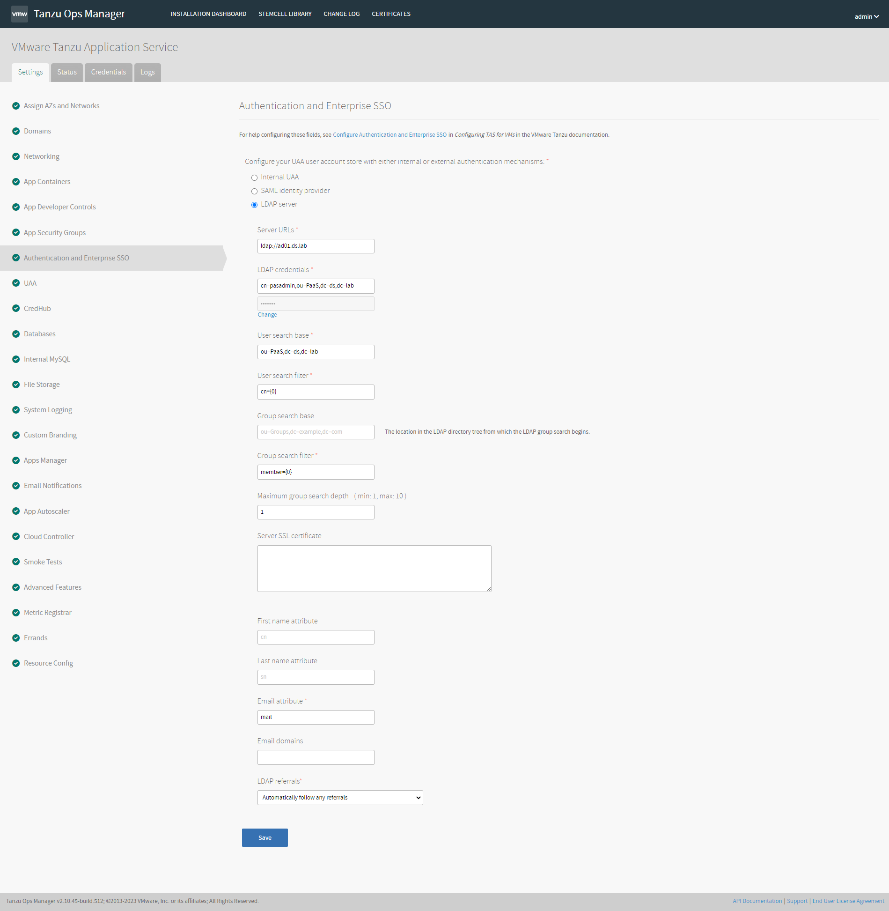

1. **Configure your UAA user account store with either internal or external authentication mechanisms** 
   
   -  Internal UAA : 내부 UAA를 선택하고 절차에 따라 비밀번호 정책을 구성하십시오.
   
   - SAML identity provider : SAML을 통해 외부 ID 공급자에 연결하려면 선택 후 구성하십시오.
   
   - LDAP server : 외부 LDAP 서버에 연결하려면 선택 후 구성하십시오.

##### 모든 설정 입력 후 Save를 클릭합니다.

- ### **UAA**

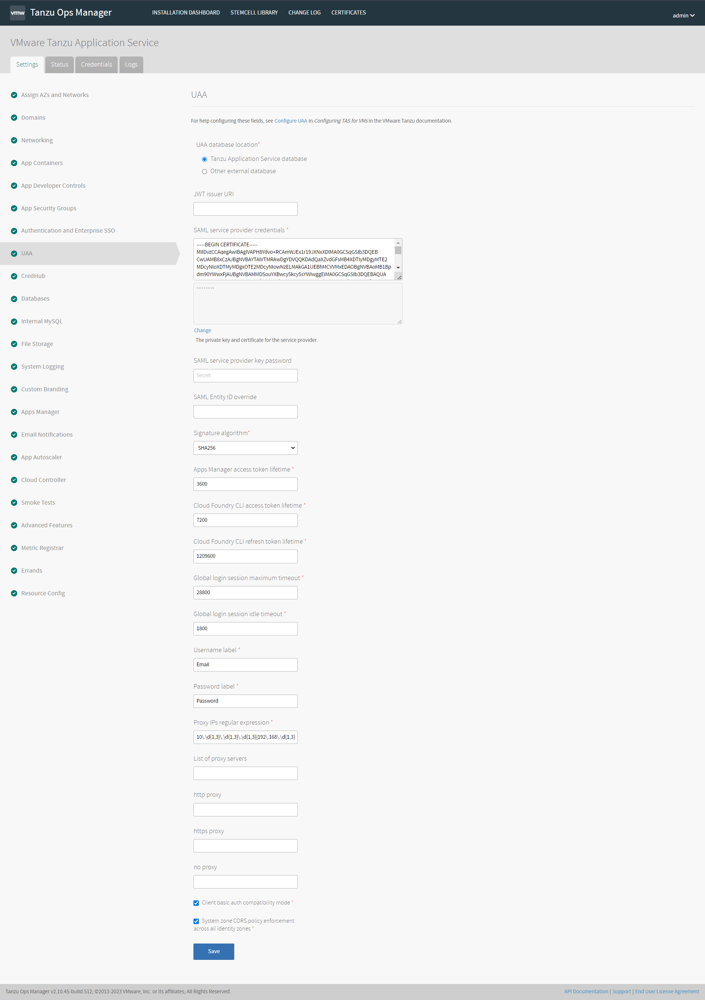

1. **UAA database location** : 다음 옵션 중 하나를 선택합니다.
   
   - Tanzu Application Service database : 다른 컴포넌트 VM이 사용하는 것과 동일한 데이터베이스 서버를 사용합니다.
   
   - Other external database : UAA에 대해 별도의 전용 데이터베이스 서버를 사용합니다.

2. (선택)**JWT issuer URI** : UAA가 토큰을 생성할 때 발급자로 사용하는 URI를 입력합니다.

3. **SAML service provider credentials** : UAA가 나가는 SAML 인증 요청에 서명하기 위해 SAML 서비스 공급자로 사용할 인증서 및 개인 키를 입력합니다.
   
   - Generate RSA Certificate 클릭
     
     - ex) `*.DOMAIN.com`, `*.apps.DOMAIN.com`, `*.sys.DOMAIN.com`,`*.login.sys.DOMAIN.com`, `*.uaa.sys.DOMAIN.com`

4. (선택)**SAML service provider key password** : SAML service provider credentials에 개인 키 비밀번호로 보호된 경우 비밀번호를 입력합니다.

5. (선택)**SAML Entity ID override** : 사용자 지정 SAML 엔터티를 입력하여 기본값(http://login.SYSTEM-DOMAIN)을 재정의하려면 ID를 입력합니다.

6. **Signature algorithm** : 서명 알고리즘을 선택합니다. 기본값은 SHA256입니다.

7. **Apps Manager access token lifetime**
   
   **Cloud Foundry CLI access token lifetime**
   
   **Cloud Foundry CLI refresh token lifetime**  
   
   - (선택)Apps Manager 및 cf CLI 로그인 액세스 및 새로 고침에 부여된 토큰의 수명을 변경합니다. 대부분의 배포는 기본값을 사용합니다.

8. **Global login session maximum timeout** 
   
   **Global login session idle timeout** 
   
   - 글로벌 로그인 시간이 초과되기 전의 최대 시간(초)를 변경합니다. 
   
   - 기본 영역 세션(Apps Manager, Ops Manager Metrics 및 UAA 기본 영역을 사용하는 기타 웹 UI의 세션) 과 UAA ID 영역을 사용하는 앱 영역이 이에 해당합니다.

9. (선택)**Username label, Password label** : cf CLI 및 Apps Manager 로그인 팝업 텍스트 프롬프트를 사용자 지정합니다.

10. (선택)**Proxy IPs regular expression** : UAA가 역방향 프록시 IP 주소로 간주하는 파이프로 구분된 정규식 집합이 포함되어 있습니다.

11. (선택) 프록시를 인식하도록 UAA를 구성하려면 다음 필드를 설정합니다.
    
    - **List of proxy servers:** HTTP/TCP 백엔드의 첫 번째 그룹에 대한 라우터 IP 주소의 쉼표로 구분된 목록을 입력합니다.
    
    - **http proxy:** http를 통한 모든 요청에 사용되는 VM의 http_proxy를 입력합니다.
    
    - **https proxy:** https를 통한 모든 요청에 사용되는 VM의 https_proxy를 입력합니다.
    
    - **no proxy:** 쉼표로 구분된 도메인, IP 주소 또는 DNS 접미사 목록을 입력합니다.

12. (선택)**Client basic auth compatibility mode** : UAA 클라이언트 기본 인증 자격 증명에 URL 인코딩을 요구하려면 클라이언트 기본 인증 호환성 모드 확인란을 비활성화합니다. 기본적으로 확인란이 활성화되어 있으며 URL 인코딩이 필요하지 않습니다.

13. (선택)**System zone CORS policy enforcement across all identity zones** : TAS Single Sign-On을 사용 중이고 사용자 지정 ID 영역에 대한 CORS 정책을 준수하려면 확인란을 선택 취소합니다. 이 확인란은 기본적으로 활성화 되어있습니다. 선택한 상태이면 UAA는 사용자 지정 ID 영역에 대한 CORS 정책을 무시하고 시스템 기본 ID 영역 CORS 정책을 모든 영역에 적용합니다.

##### 모든 설정 입력 후 Save를 클릭합니다.

- ### **CredHub**

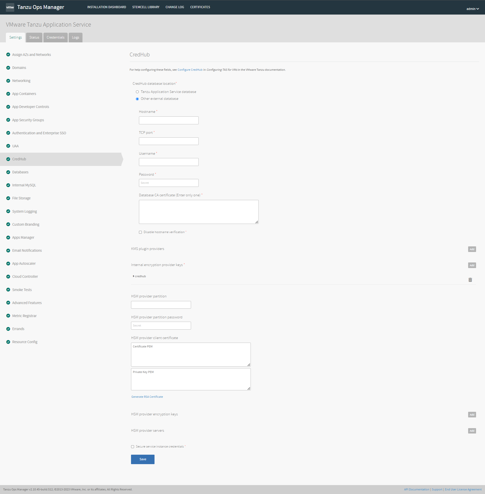

1. **CredHub database location** : CredHub 데이터베이스의 위치를 선택합니다. TAS for VMs에는 서비스 인스턴스 자격 증명을 저장하기 위한 서비스용 CredHub 데이터베이스가 포함되어 있습니다.
   
   - Tanzu Application Service database : 이 옵션을 선택하면 CredHub는 데이터베이스가 내부인지 외부인지에 관계없이 다른 TAS for VMs 구성 요소와 동일한 데이터베이스를 사용합니다. 
   
   - Other external database : 이 옵션을 선택하는 경우 다음 필드를 구성합니다.
     
     - Hostname, TCP port, Username, Password, Database CA certificate (Enter only one), Disable hostname verification

2. (선택)**KMS plugin providers** : 하나 이상의 KMS(키 관리 서비스) 공급자를 지정합니다.

3. **Internal encryption provider keys** : CredHub 데이터베이스에 저장된 값을 암호화하고 해독하는데 사용할 하나 이상의 키를 지정합니다. 
   
   - Name : 키 이름을 입력합니다.
   
   - Key : 20자 이상의 값을 입력합니다. 이 키는 모든 데이터를 암호화하는데 사용됩니다.
   
   - Primary : 이 확인란은 위에서 지정한 키를 기본 암호화 키로 표시합니다. 둘 이상의 기본키를 생성할 수 없습니다.

4. (선택)HSM(하드웨어 보안 모듈)을 암호화 공급자로 사용하려는 경우 다음 필드를 구성합니다.
   
   - HSM provider partition, HSM provider partition password, HSM provider client certificate, HSM provider encryption keys, HSM provider servers

5. (선택)배포시 CredHub에 서비스 인스턴스 자격 증명(서비스 바인딩) 저장을 원하는 Ops Manager 서비스를 사용하고 이 기능을 활성화 하기 위해서 확인란을 활성화합니다.
   
   

##### 모든 설정 입력 후 Save를 클릭합니다.

- ### **Databases**

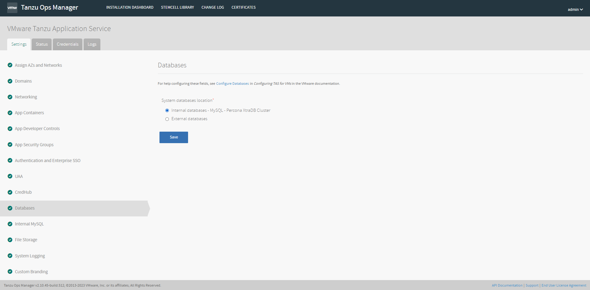

1. **System databases location**
   
   - Internal databases - MySQL - Percona XtraDB Cluster : Ops Manager와 함께 제공되는 내부 MySQL 데이터베이스를 사용하도록 TAS를 구성합니다.
   
   - External databases : 외부 데이터베이스를 구성하기 위해 설정합니다.
   
   

##### 모든 설정 입력 후 Save를 클릭합니다.

- ### **(선택) Internal MySQL**

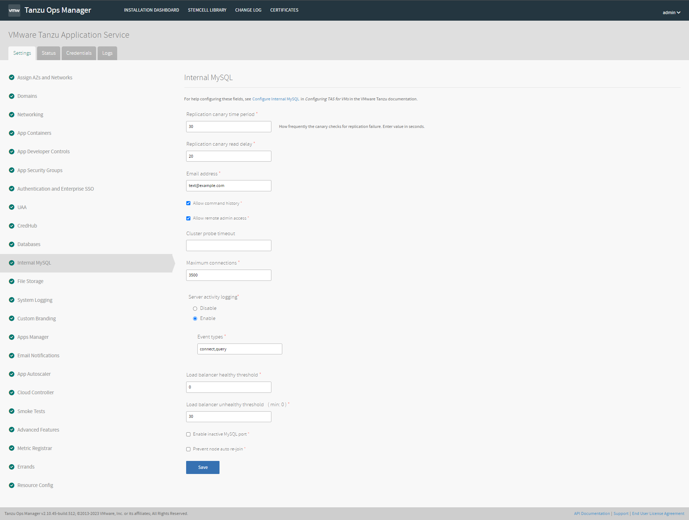

Databases 창에서 Internal databases를 선택한 경우에만 이 섹션을 구성할 수 있습니다.

1. **Replication canary time period** : canary 복제 실패를 확인하는 빈도를 지정합니다. 기본값인 30초를 그대로 두거나 배포 요구 사항에 따라 값을 수정합니다.

2. **Replication canary read delay** : 데이터가 각 MySQL 노드에서 복제되고 있음을 확인하기 전에 canary가 대기하는 시간(초)을 지정합니다.

3. **Email address** : 클러스터에 복제 문제가 발생하거나 노드가 클러스터에 자동 재결합하도록 허용되지 않을 때 MySQL 서비스가 경고를 보내는 이메일 주소를 입력합니다.

4. **Allow command history** : 기본적으로 활성화되어 있습니다. MySQL 노드에서 명령줄 기록 파일 생성을 금지하려면 이 확인란을 선택 취소합니다.

5. **Allow remote admin access** : 관리 및 읽기 전용 관리 사용자가 모든 원격 호스트에서 연결할 수 있도록 허용하려면 원격 관리 액세스 허용확인란을 선택합니다.

6. **Cluster probe timeout** : 새 노드가 기존 클러스터 노드를 검색하는 최대 시간(초)을 입력합니다. 공백 값은 10초입니다.

7. **Maximum connections** : 데이터베이스에 허용되는 최대 연결 수를 입력합니다. 기본값은 3500입니다.

8. **Server activity logging** : MySQL 서비스가 기록할 이벤트를 입력할 수 있습니다.

9. **Load balancer healthy threshold** : MySQL 프록시 인스턴스가 시작되었음을 보고할 때까지 대기할 시간(초)을 입력합니다. 기본값은 0초 입니다.

10. **Load balancer unhealthy threshold** : MySQL 프록시가 종료되기 전에 연결을 계속 수락하는 시간을 초 단위로 입력합니다. 기본값은 30초입니다.

11. **Enable inactive MySQL port** : MySQL 프록시가 포트 3336에서 수신을 대기하도록 하려면 확인란을 선택합니다.

12. **Prevent node auto re-join** : MySQL Interruptor를 사용하여 데이터가 일치하지 않는 노드가 MySQL 데이터베이스에 기록되지 않도록 합니다.

##### 모든 설정 입력 후 Save를 클릭합니다.

- ### **File Storage**

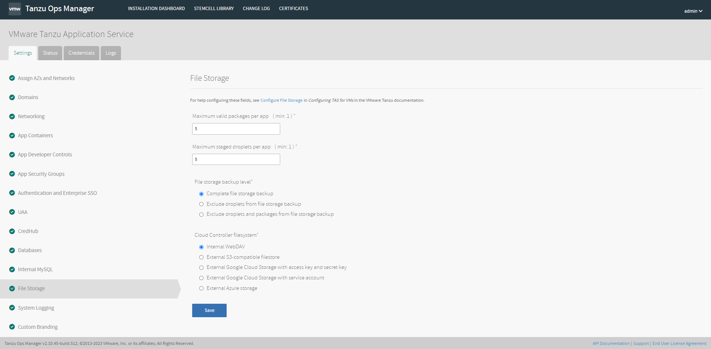

**Maximum valid packages per app** : 현재 droplet에 대한 패키지를 포함하지 않고 앱이 저장할 수 있는 앱당 최대 유효 패키지의 최대 수를 설정하려면 값을 입력합니다. 기본값은 2입니다.

1. **Maximum staged droplets per app** : 현재 droplet에 대한 패키지를 포함하지 않고 앱이 저장할 수 있는 앱당 최대 드롭렛 필드에 값을 입력합니다.

※ *Note:  Droplet : 앱을 Diego Cell VM에 배포하기 전 클라우드 컨트롤러는 빌드팩 및 소스 코드를 Diego Cell VM이 압축을 풀고 컴파일하고 실행할 수 있는 형태*

3. **File storage backup level** : Blobstore에서 백업할 항목을 선택합니다.
   
   - Complete file storage backup : 전체 blobstore가 포함됩니다. 여기에는 droplet, 패키지 및 빌드팩이 포함됩니다.
   
   - Exclude droplets from file storage backup : 백업에서 droplet을 제외합니다. 이 옵션을 선택하면 복원 중에 모든 앱을 re-stage 해야 합니다.
   
   - Exclude droplets and packages from file storage backup : 백업에서 droplet 및 패키지를 제외합니다. 이 옵션을 선택하면 복원 중에 모든 앱을 다시 re-push 해야 합니다.

4. **Cloud Controller filesystem** : Internal WebDAV를 제외한 다른 옵션은 환경 구성에 따라 선택합니다.

##### 모든 설정 입력 후 Save를 클릭합니다.

- ### **(선택)System Logging**

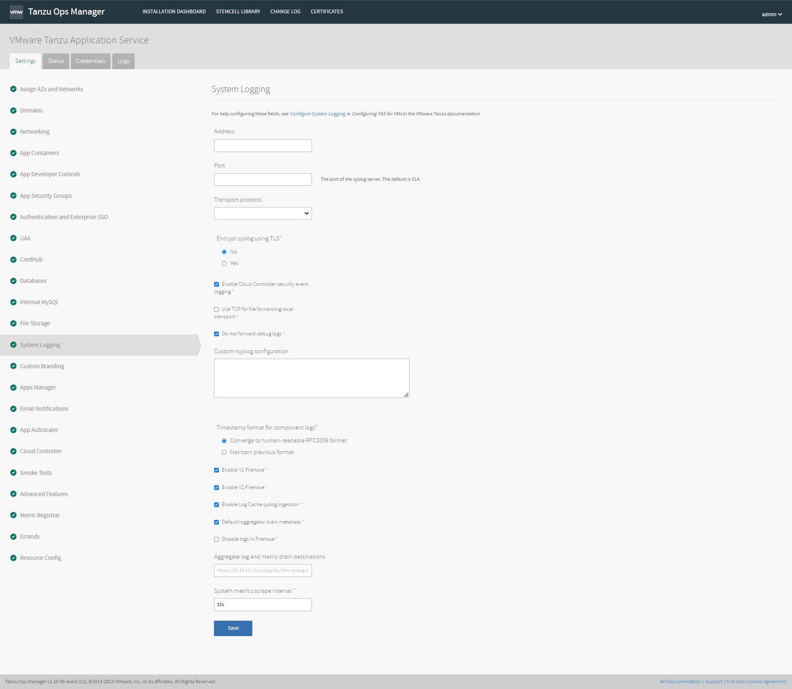

System Logging 창 에서 TAS 컴포넌트 VM의 로그 메시지를 외부 서비스로 전달하도록 TAS의 시스템 로깅을 구성할 수 있습니다.

1. **Address, Port, Transport protocol** : syslog 서버의 정보를 입력합니다.

2. **Encrypt syslog using TLS** : TLS를 사용하여 syslog를 암호화 할 수 있습니다.

3. **Enable Cloud Controller security event logging** : 로그 스트림에 보안 이벤트를 포함하려면 확인란을 선택합니다. 

4. **Use TCP for file forwarding local transport** : 확인란을 활성화하여 TCP를 통해 로그를 전송합니다.

5. **Do not forward debug logs** : 확인란은 기본적으로 활성화되어 있습니다. DEBUG syslog 메시지를 외부 서비스로 전달하려면 확인란을 비활성화합니다.

6. **Custom rsyslog configuration** : 사용자 지정 syslog 규칙을 입력합니다.

7. **Timestamp format for component logs** : 컴포넌트 로그의 타임스탬프 형식 중 하나를 선택합니다.

8. TAS가 배포 환경에서 수집을 위해 앱 로그 및 앱 메트릭을 내보내는 방법을 구성합니다.
   
   다음 표는 필드 값에 대한 자세한 정보를 제공합니다.
   
   | 필드 명                                            | 설명                                                                                                                                                                       |
   | ----------------------------------------------- | ------------------------------------------------------------------------------------------------------------------------------------------------------------------------ |
   | **Enable V1 Firehose**                          | 기본적으로 활성화됩니다. 활성화되면 앱 로그 및 앱 지표가 Loggregator V1 Firehose로 흐릅니다.                                                                                                          |
   | **Enable V2 Firehose**                          | 기본적으로 활성화됩니다. 활성화되면 앱 로그 및 앱 메트릭이 Loggregator V2 Firehose로 흐릅니다. 체크박스를 선택 취소하여 V2 Firehose를 비활성화하면 V1 Firehose도 비활성화해야 합니다.                                              |
   | **Enable Log Cache syslog ingestion**           | 기본적으로 비활성화되어 있습니다. 역방향 로그 프록시 대신 syslog 서버를 통해 앱 로그 및 앱 메트릭을 수집하도록 로그 캐시를 구성합니다. V1 Firehose를 비활성화하는 경우 서비스 타일 메트릭을 수신하려면 로그 캐시 syslog 수집을 활성화해야 합니다.                    |
   | **Default loggregator drain metadata**          | 기본적으로 활성화됩니다. 활성화되면 TAS는 앱의 모든 메타데이터를 전송하고 syslog 드레인을 집계합니다. 이 옵션을 비활성화하면 외부 데이터베이스에 대한 로깅을 최대 50%까지 줄일 수 있습니다.                                                         |
   | **Disable logs in Firehose**                    | 기본적으로 선택 취소되어 있습니다. Firehose가 앱 로그를 내보내는 것을 방지하지만 Firehose가 앱 메트릭을 내보내는 것은 허용합니다. Firehose에서 로그를 비활성화하면 Doppler 및 트래픽 컨트롤러 VM을 축소할 수 있으므로 VM에 대한 TAS의 부하를 줄이는 데 도움이 됩니다. |
   | **Aggregate log and metric drain destinations** | 집계 드레이닝은 기반의 모든 앱 로그를 이 필드에 제공하는 엔드포인트로 전달합니다. 집계 로그 드레인에 대한 쉼표로 구분된 syslog 엔드포인트 목록을 입력합니다.                                                                             |

9. **System metrics scrape interval** : 시스템 메트릭을 로깅 엔드포인트로 더 자주 또는 덜 자주 보내기 위해서 해당 값을 변경합니다. 기본값은 1m이고 최소 권장 값은 5s 입니다.

##### 모든 설정 입력 후 Save를 클릭합니다.

- ### **(선택)Custom Branding**

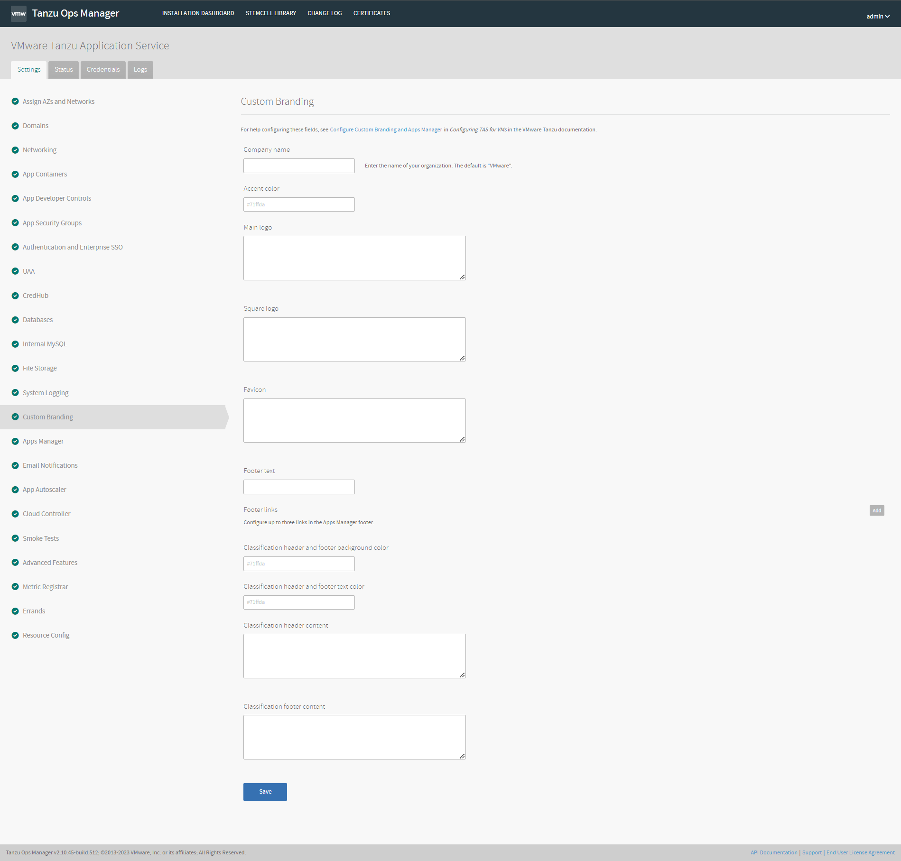

1. TAS 로그인 포털 및 Apps Manager의 모양을 사용자 지정할 수 있습니다.

- ### **(선택)Apps Manager**

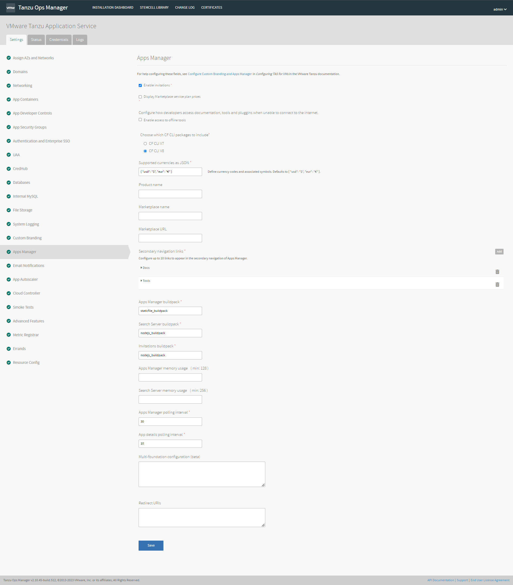

1. **Enable invitations** : 앱 관리자에서 초대를 활성화하려면 확인란을 선택합니다. Org Manager는 지정된 org에 새 사용자를 초대할 수 있고 Admin은 모든 org 및 space에 새 사용자를 초대할 수 있습니다.

2. **Display Marketplace service plan prices** : Marketplace에 서비스 plan 가격을 표시합니다.

3. **Choose which CF CLI packages to include** : 포함할 cf CLI 버전을 선택합니다.

4. **Supported currencies as JSON** : 지원되는 통화를 JSON으로 입력하여 Marketplace에 표시합니다.

5. **Product name, Marketplace name, Marketplace URL** : 사용자의 Marketplace를 가리키도록 설정할 수 있습니다.

6. **Secondary navigation links** : 보조 탐색 링크 URL을 입력할 수 있습니다.

7. (선택)**Apps Manager buildpack, Search Server buildpack, Invitations buildpack** : 해당 필드에 설정하고 싶은 빌드팩 명을 지정합니다.

8. **Apps Manager memory usage** : 앱을 배포할 메모리 제한을 설정합니다. out of memory 오류로 인해 앱이 시작되지 않을 때 이 필드 값을 늘립니다. 공백 기본값은 128MB입니다.

9. **Search Server memory usage** : 검색 서버 앱을 배포하는데 사용할 메모리 제한을 설정합니다. 공백 기본값은 256MB입니다.

10. **Invitations memory usage** : 초대 앱을 배포할 메모리 제한을 설정합니다. 공백 기본값은 256MB입니다.

11. **Apps Manager polling interval** : Apps Manager 폴링 간격 필드는 Apps Manager 사용으로 인해 Cloud Controller 응답 시간이 저하될 경우 임시 해결책을 제공합니다. 이 필드는 Apps Manager 성능을 저하시킬 수 있으므로 장기적인 수정 사항으로 수정하지 않는 것이 좋습니다. 

##### 모든 설정 입력 후 Save를 클릭합니다.

---

- ### **(선택)Email Notifications**

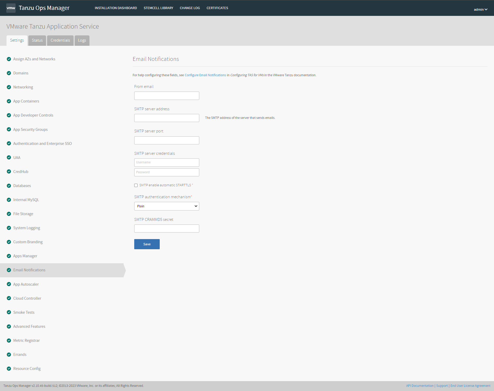

TAS는 SMTP를 사용하여 Apps Manager 사용자에게 초대 및 확인을 보낼 수 있습니다. 이 서비스가 필요하지 않으면 창을 비워놓고 다음 설정을 진행합니다.

##### 모든 설정 입력 후 Save를 클릭합니다.

- ### **(선택)App Autoscaler**

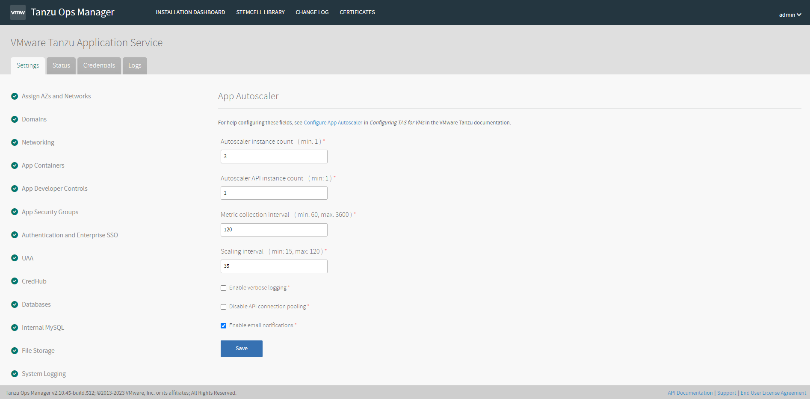

App Autoscaler를 사용하려면 서비스 인스턴스를 생성하고 앱에 바인딩해야 합니다. 

1. **Autoscaler instance count** : App Autsocaler 서비스의 인스턴스 수를 입력합니다. 기본값은 3입니다. 대규모 환경에서는 기본 수보다 더 많은 인스턴스가 필요할 수 있습니다. App Autoscaler를 사용하는 앱 10개당 하나의 App Autoscaler 인스턴스를 권장합니다.

2. **Autoscaler API instance count** : 배포할 AppAutoscaler API 인스턴스 수를 입력합니다. 기본값은 1입니다. 대규모 환경에서는 기본 수보다 많은 인스턴스가 필요할 수 있습니다.

3. **Metric collection interval** : 메트릭 수집 간격에 스케일링 결정을 내릴 때  AppAutoscaler에서 평가할 데이터 수집 시간(초)을 입력합니다. 최소 간격은 60초이고 최대 간격은 3600초입니다. 기본값은 120입니다.

4. **Scaling interval** : AppAutoscaler가 확장을 위해 앱을 평가하는 빈도를 초 단위로 입력합니다. 최소 간격은 15초이고 최대 간격은 120초입니다. 기본값은 35입니다.

5. **Enable verbose logging** : AppAutoscaler에 대한 상세 로깅을 사용하려면 상세 로깅 사용 확인란을 선택합니다. 상세 로깅은 기본적으로 비활성화됩니다.(이메일 또는 문자로 보냅니다.)

6. **Disable API connection pooling** : Autoscaler API에서 HTTP 연결을 재사용하지 않으려면 Disable API connection pooling 확인란을 선택합니다. Gorouter의 프론트 엔드 유휴 시간 초과가 1초와 같은 낮은 값으로 설정된 경우 이 작업이 필요할 수 있습니다.

7. **Enable email notifications** : Autoscaler 이벤트의 이메일 알림을 사용하려면 이메일 알림 사용 확인란을 선택합니다.

##### 모든 설정 입력 후 Save를 클릭합니다.

- ### **Cloud Controller**

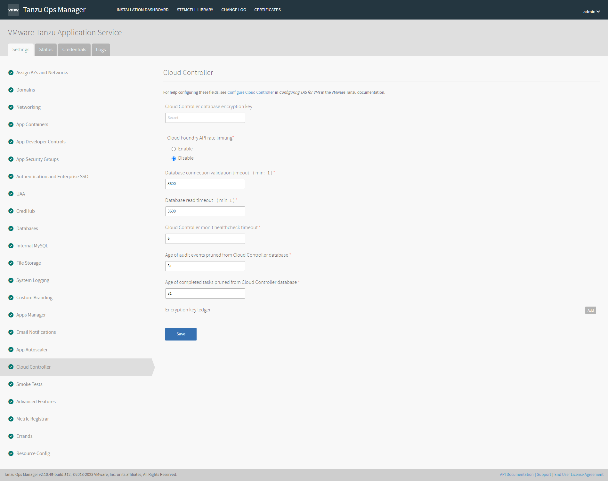

1. **Cloud Controller database encryption key** : 다음 상황이 모두 일치하면 암호화 키를 입력하십시오.
   
   - 이전에 TAS를 배포하였습니다.
   
   - 그런 다음 VM에 대한 TAS를 중지했거나 중단했습니다.
   
   - Cloud Controller 데이터베이스 백업을 사용하여 VM용 TAS를 다시 배포하려고 합니다.

2. **Cloud Foundry API rate limiting** : Cloud Foundry API 속도 제한을 비활성화하려면 Cloud Foundry API 속도 제한에서 Disable을 선택합니다. Cloud Foundry API 속도 제한을 활성화하려면 다음을 수행합니다.
   
   - General limit : 사용자 또는 클라이언트가 사용자 정의 제한이 없는 모든 엔드포인트에 대해 한 시간 간격으로 허용되는 요청 수를 입력합니다. 기본값은 2000입니다.
   
   - Unauthenticated limit : 인증되지 않은 클라이언트가 한 시간 동안 수행할 수 있는 요청 수를 입력합니다. 기본값은 100입니다.

3. (선택)**Database connection validation timeout** : 데이터베이스 연결 유효성 검사 시간 제한을 초 단위로 입력합니다. 기본적으로 설정은 3600초 또는 60분입니다. -1을 입력하여 연결이 풀에서 체크아웃될 때마다 Cloud Controller가 데이터베이스에 추가 쿼리를 수행하도록 할 수 있습니다.

4. (선택)**Database read timeout** : 데이터베이스 읽기 제한 시간(초)을 입력합니다. 기본적으로 설정은 3600초 또는 60분입니다.

5. (선택)**Cloud Controller monit healthcheck timeout** : ccng_monit_http_healthcheck 프로세스에서 보낸 각 HTTP 요청의 시간 초과(초)3

6. (선택)**Age of audit events pruned from Cloud Controller database** : CloudController 데이터베이스에서 제거된 audit 이벤트 기간(일)을 입력합니다.

7. (선택)**Age of completed tasks pruned from Cloud Controller database** : Cloud Controller 데이터베이스에서 제거된 완료된 작업의 사용 기간(일)을 입력합니다.

8. (선택)**Encryption key ledger** : Encryption key ledger field를 사용하여 CCDB(Cloud Controller Database) 암호화 키를 회전합니다.

##### 모든 설정 입력 후 Save를 클릭합니다.

- ### **Smoke Tests**

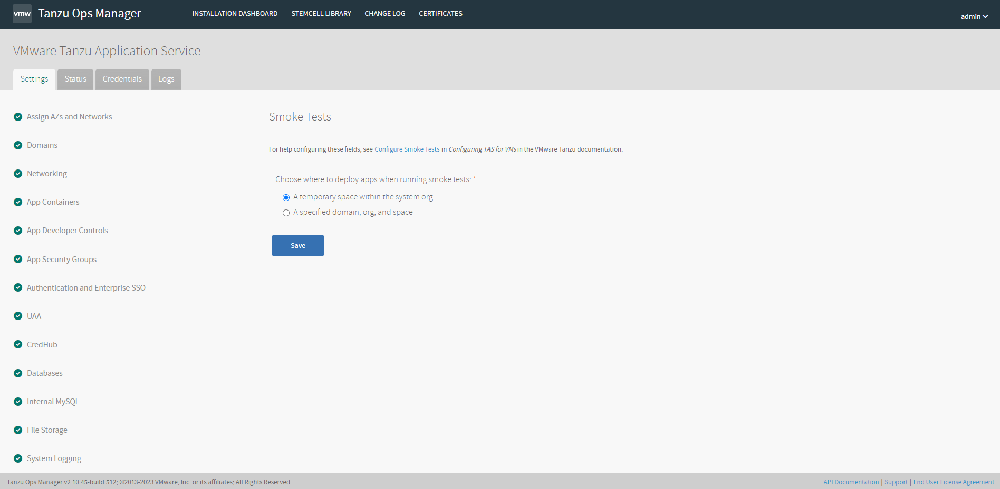

Smoke test가 실행되는 Org, Space를 구성합니다. Smoke test 시 생성된 errand 앱을 배포하여 설치 또는 업데이트 후 TAS 타일에 대해 기본 기능 테스트를 실행합니다.

- A temporary space within the system org : Shared 도메인이 있는 경우 System Org 내에 임시 공간을 선택합니다. 테스트 후 Space는 삭제 됩니다.

- A specified domain, org, and space : Smoke test를 위해 특정 Org, Space를 선택하기 위해서는 이 옵션을 선택합니다.

##### 모든 설정 입력 후 Save를 클릭합니다.

- ### **(선택)Advanced Features**

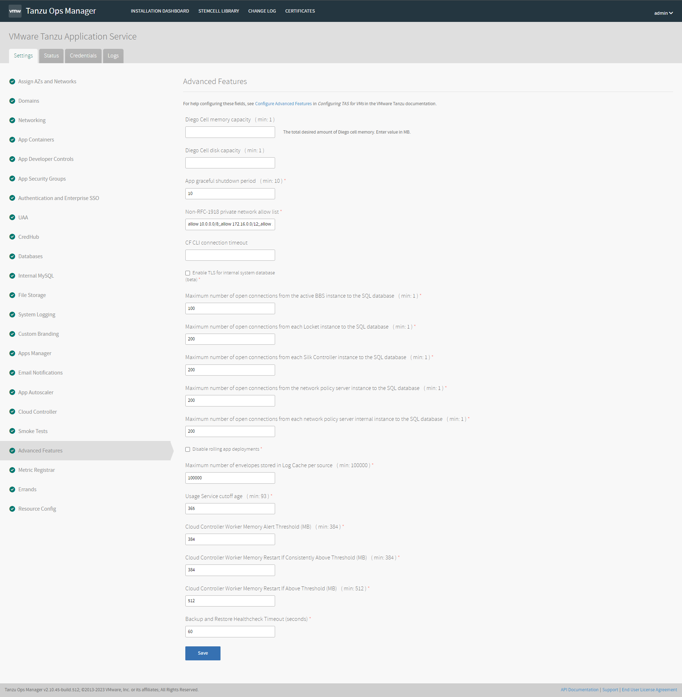

특정 제약이 있을 수 있는 기능이 포함되어 있습니다. 운영 환경에서는 해당 기능을 사용할 때 주의할 것을 권장합니다. Resource Config 탭에 있는 디스크 공간 및 메모리 세트의 전체 할당을 사용하지 않는 경우 이 기능을 사용할 수 있습니다. 이 필드는 디스크 및 메모리 리소스를 각 Diego Cell VM에 오버 커밋하는 양을 제어합니다.

1. **Diego Cell memory capacity** : Diego Cell 메모리 용량 필드에 원하는 총 Diego Cell 메모리 양을 MB로 입력합니다.

2. **Diego Cell disk capacity** : Diego Cell 디스크 용량 필드에 원하는 총 Diego Cell 디스크 용량을 MB로 입력합니다. 

3. **App graceful shutdown period** : 앱이 진행 중인 작업을 완료하고 정상적으로 종료하는 데 더 오랜 시간이 필요한 경우 정상 종료 기간을 늘릴 수 있습니다. 기본값은 10초로 설정 되어 있습니다.

4. **Non-RFC-1918 private network allow list** : 사설 네트워크 망을 사용할 시 사용 네트워크 정보 추가해야합니다. 일반적으로 `10.0.0.0/8, 172.16.0.0/12`, or `192.168.0.0/16`를 사용합니다.

5. **CF CLI connection timeout** : Timeout은 Notifications, AutoScaler 및 Apps Manager와 같은 VM errand 앱을 배포하는 데 사용되는 cf CLI 명령에 영향을 줍니다.

6. Diego 및 컨테이너 네트워킹 구성 요소가 가질 수 있는 동시 최대 데이터베이스 연결 수를 구성할 수 있습니다.

7. **Disable rolling app deployments** : 롤링 앱 배포를 비활성화 할 수 있습니다.

8. **Maximum number of envelopes stored in Log Cache per source** : 로그 캐시에 저장 된 최대 envelopes수를 조정할 수 있습니다. 기본적으로 로그 캐시는 100,000개의 envelopes를 유지합니다.

9. **Usage Service cutoff age** : Usage Service는 365일후에 세분화 된 데이터를 삭제합니다.

##### 모든 설정 입력 후 Save를 클릭합니다.

- ### **(선택)Metric Registrar**

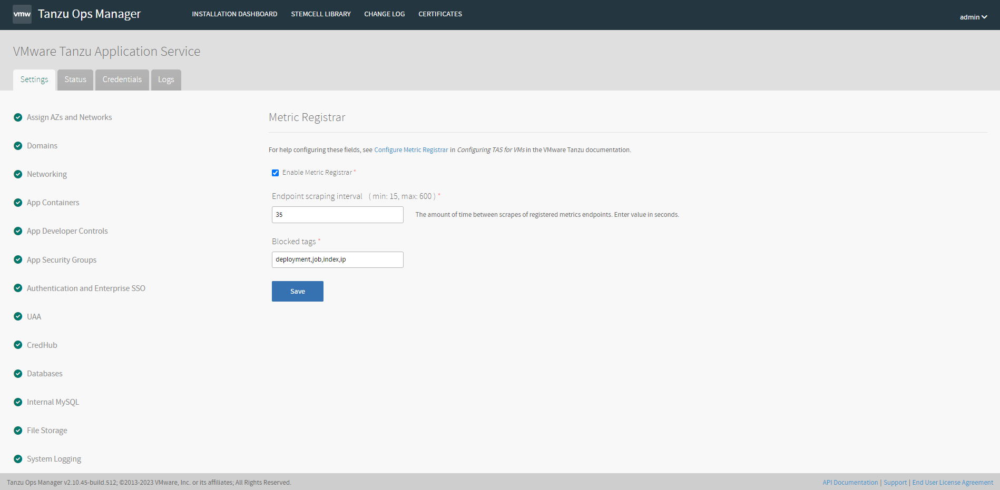

Metric Registrar를 사용하면 구조화된 로그를 메트릭으로 변환할 수 있습니다. 또한 메트릭 엔드포인트를 스크랩하고 메트릭을 Loggregator로 전달합니다. 

1. **Enable Metric Registrar** : 기본적으로 비활성화 되어있습니다.

2. **Endpoint scraping interval** : 스크래핑 간격은 Metric Registrar가 사용자 지정 메트릭 끝점을 폴링하는 빈도를 정의합니다. 기본값은 35초입니다.

3. **Blocked tags** : 기본적으로 다음 태그는 해당 태그를 사용하고 의존하는 앱 메트릭과 같은 다른 제품과의 간섭을 방지하기 위해 차단됩니다.
   
   - `deployment`
   - `job`
   - `index`
   - `id`

##### `모든 설정 입력 후 Save를 클릭합니다.`

---

- ### **Errands**

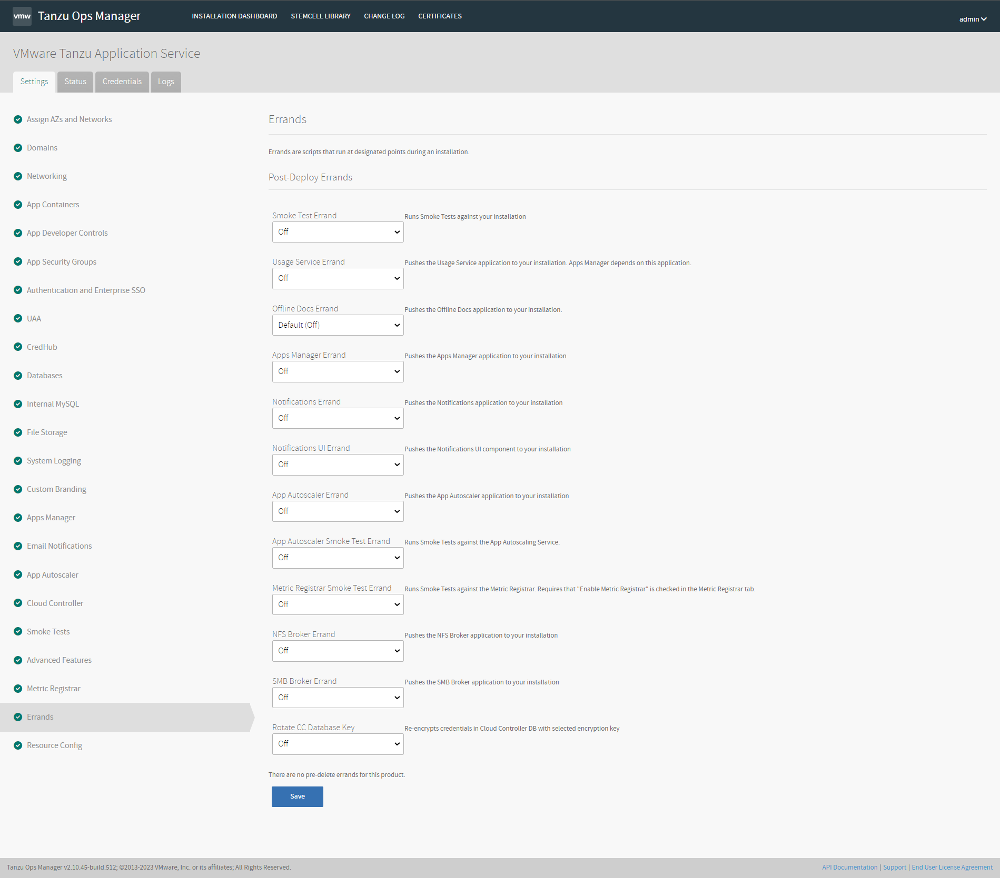

| 항목                                     | 기능                                                                                 |
| -------------------------------------- | ---------------------------------------------------------------------------------- |
| **Smoke Test Errand**                  | 배포 환경에서 앱을 배포, 스케일 그리고 삭제할 수 있는지 또한 org, space를 구성할 수 있는지 확인합니다.                   |
| **Usage Service Errand**               | Apps Manager가 종속된 Usage Service 앱을 배포합니다.                                          |
| **Apps Manager Errand**                | 초기 Apps Manager 대시보드를 배포합니다. Apps Manager를 구축한 후에는 Off 로 설정합니다.                    |
| **Notifications Errand**               | 플랫폼 사용자에게 TAS 관련 이메일을 보내기 위한 API를 배포합니다.                                           |
| **Notifications UI Errand**            | 사용자가 알림 구독을 관리할 수 있는 대시보드를 배포합니다.                                                  |
| **App Autoscaler Errand**              | App Autoscaler 앱을 배포하므로 앱의 사용량 로드 변화에 따라 앱이 자동으로 확장되도록 구성할 수 있습니다.                 |
| **App Autoscaler Smoke Test Errand**   | AppAutoscaler에 대해 Smoke test를 실행합니다.                                               |
| **NFS Broker Errand**                  | NFS Volume Services for TAS를 지원하는 NFS Broker 앱을 배포합니다.                             |
| **Metric Registrar Smoke Test Errand** | Metric Registrar가 앱에서 내보내는 사용자 지정 메트릭에 액세스하여 이를 Loggregator 메트릭으로 변환할 수 있는지 확인합니다. |
| **SMB Broker Application Errand**      | VM용 SMB Volume Services for TAS를 지원하는 SMB Broker 앱을 배포합니다.                         |
| **Rotate CC Database Key**             | Cloud Controller 데이터베이스의 중요한 데이터를 현재 지정된 기본 키로 변환합니다.                              |

##### 

##### `모든 설정 입력 후 Save를 클릭합니다.`

---

- ### **Resource Config**

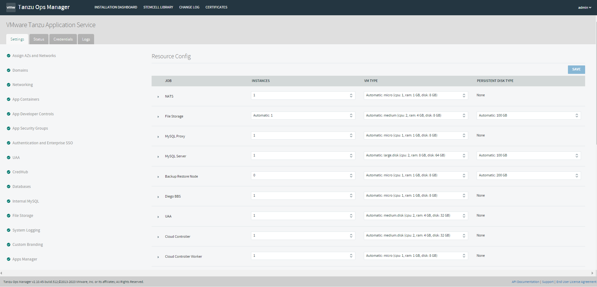

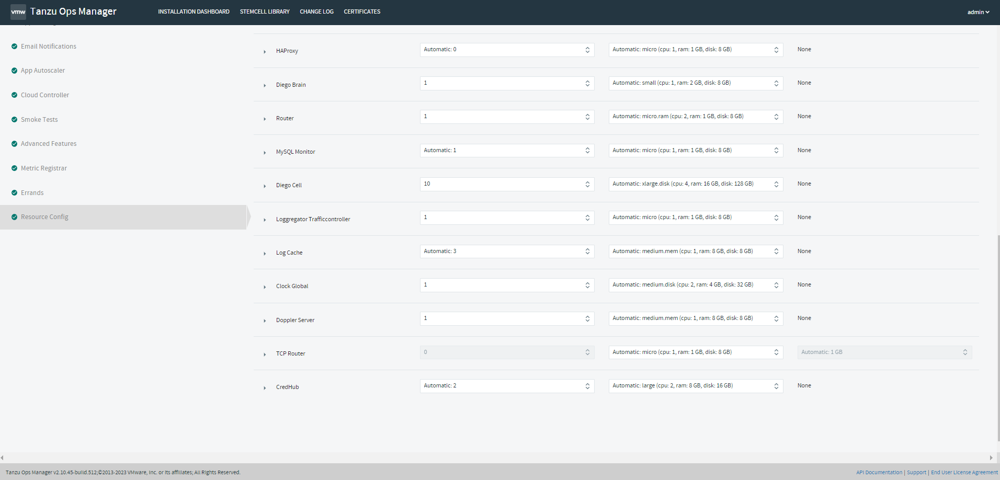

구성 환경에 맞게 Resource Config를 설정합니다. (MySQL Server는 홀수 1, 3로 설정합니다.)

1. 외부 S3 호환 파일 저장소를 사용하도록 TAS를 구성한 경우 **File Storage** 필드 에 INSTANCES를`0` 설정합니다.

2. UAA, 시스템 및 CredHub 데이터베이스를 구성할 때 **External** 선택한 경우 다음 필드를 편집합니다.
   
   - MySQL Proxy : INSTANCES `0` 을 설정합니다.
   - MySQL Server : INSTANCES `0` 을 설정합니다.
   - MySQL Monitor : INSTANCES `0` 을 설정합니다.

3. TCP 라우팅을 비활성화한 경우 TCP Router INSTANCES `0` 을 설정합니다.

4. HAProxy를 사용하지 않는 경우 HAProxy INSTANCES `0` 을 설정합니다.

##### `모든 설정 입력 후 Save를 클릭합니다.`

---

